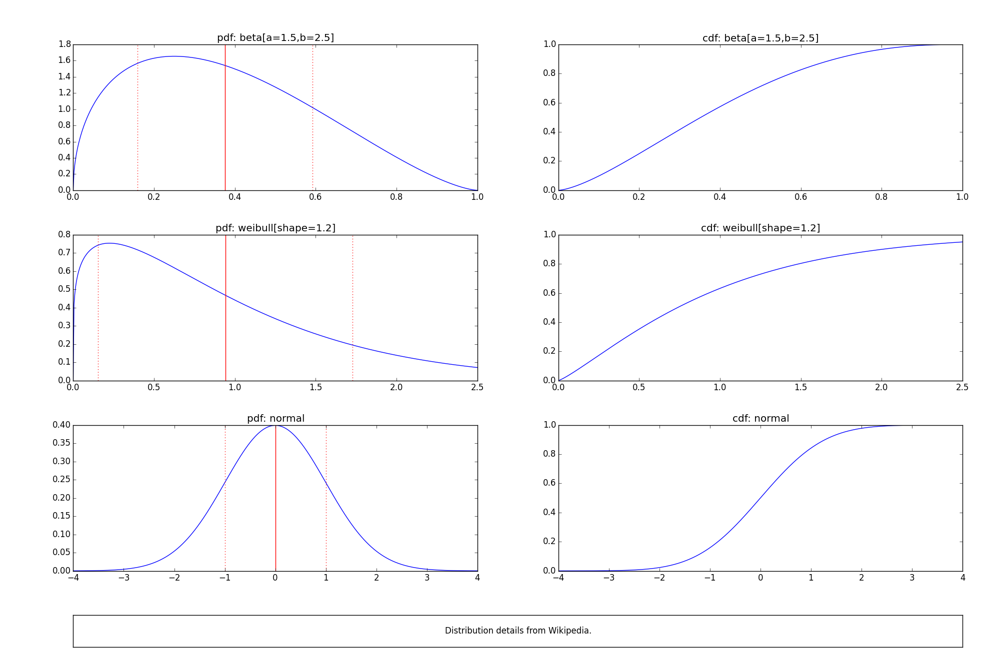

:mod:`mplext` --- Some matplotlib utilities
===========================================

This module provides utilities for matplotlib.

An example
----------

The following piece of code illustrates the use of this module:

.. literalinclude:: ../demo/mplext.py
   :language: python
   :tab-width: 2

Typical output:

|output|

Available types and functions
-----------------------------

.. automodule:: myutil.mplext
   :members:
   :member-order: bysource
   :show-inheritance:
